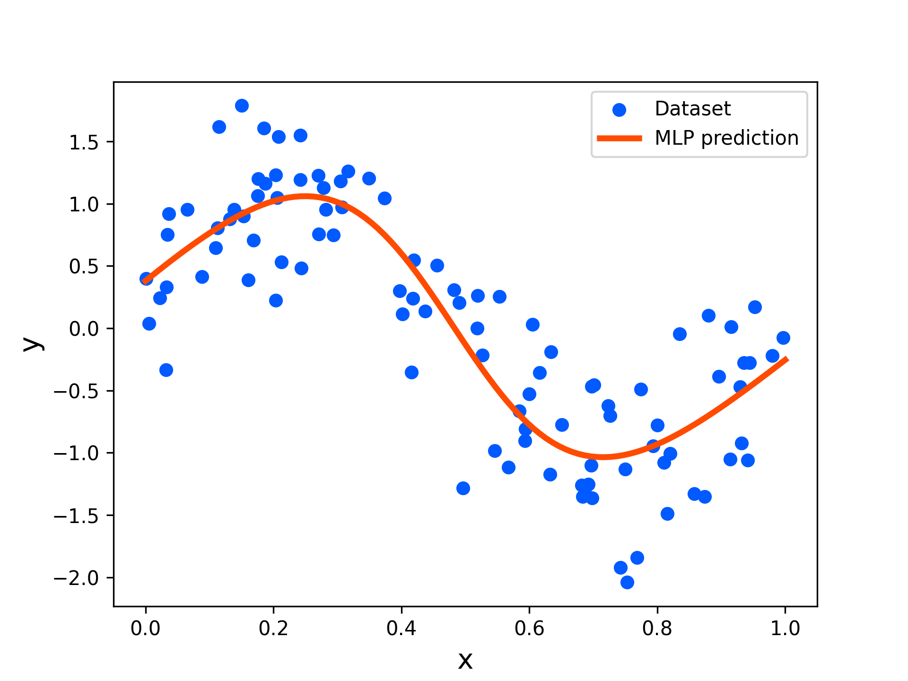

[](https://opensource.org/licenses/MIT)
[](https://rye.astral.sh)

# Neural Network Playground
Basic implementations of neural network models using Jax and Pytorch.

## Development Environment

- common
    ```
    Ubuntu 20.04
    Python 3.12.3
    Cuda 12.1
    ```
- [jax](https://jax.readthedocs.io/en/latest/index.html)
    ```
    jax 0.4.35
    flax 0.10.2
    optax 0.2.4
    clu 0.0.12
    ```
- [pytorch](https://pytorch.org/)
    ```
    pytorch 2.3.1
    torchvision 0.18.1
    torchaudio 2.3.1
    torchviz 0.0.2
    torchview 0.2.6
    ```

## Setup

### For Jax Users
```bash
git clone https://github.com/MizuhoAOKI/neural_network.git
cd neural_network
cp ./pyproject_jax.toml ./pyproject.toml
rye sync
```

### For Pytorch Users
```bash
git clone https://github.com/MizuhoAOKI/neural_network.git
cd neural_network
cp ./pyproject_pytorch.toml ./pyproject.toml
rye sync
```

## Usage

### For Jax Users
```bash
rye run jupyter notebook notebooks/mlp_jax.ipynb
```

### For Pytorch Users
```bash
rye run jupyter notebook notebooks/mlp_pytorch.ipynb
```

